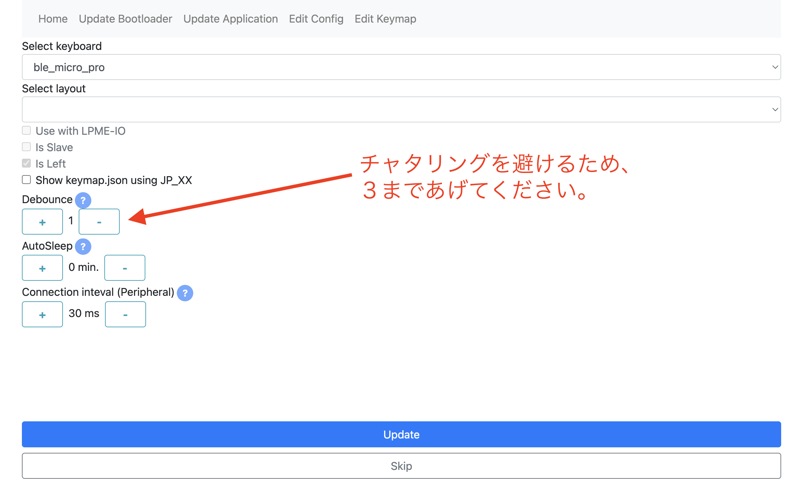

## Build guide

## Firmware

###  QMK_FIRMWARE

[Here](https://github.com/telzo2000/cool836qalble/tree/main/firmware/cool836qalble)

 

[remap](https://remap-keys.app/catalog/FEmXx8GyuKYuJ5JSfcQG)

 

## Build 1

### 1 Diode soldering

Solder the diodes to the back of PCB.
 
PCBの裏面にダイオードのハンダ付けをします。
 

There are lead type and SMD diodes.
 
ダイオードはリードタイプか、SMDがあります。
 
Here, we will explain the lead type soldering.
 
ここでは、リードタイプのハンダ付けの説明をします。
 

Use a lead bender to bend the legs of the diode.
 
リードベンダーを使い、ダイオードの足を曲げます。
 

Insert the diode into the board.
 
ダイオードを基板に挿しこみます。
 

Please pay attention to the orientation of the diode.
 
ダイオードの向きに注意してください。
 

Secure the diode with masking tape, then face up.
 
マスキングテープでダイオードを固定してから、表面を上にします。
 
Solder the protruding legs.
 
はみ出ている足部分に、ハンダ付けをします。
 
After soldering, use nippers to cut off the protruding legs.
 
はんだ付けが終わったら、はみ出ている足をニッパーで切り取ってください。
 

[８倍速　Diodeハンダ付け動画](https://youtu.be/Yaodh2-XxV4)

 
 

### 2 Soldering switch sockets

Solder the switch sockets on the back side.
 
裏面にスイッチソケットのハンダ付けをします。
 

[８倍速　Switch socketハンダ付け動画](https://youtu.be/E__mHvmIXQo)

  

### 3 Mounting the Ble Micro Pro

Conthrough specifications are recommended.
 
コンスルーの仕様を推奨します。
 
 
A 12-pin or 13-pin connector is required. Even with 12 pins, there is no problem in use by inserting it closer to the USB-C terminal side as shown in the image.
 
コンスルーは12ピンまたは13ピンが必要です。12ピンでも画像のようにUSB-C端子側に寄せて差し込むことで、使用上、問題ありません。
 

Please take a look at the image below and pay attention to the orientation of the Ble Micro Pro.
 
下の画像を見て、Ble Micro Proの向きに気を付けて装着してください。
 

### 4 Soldering the battery board

Assemble the battery board according to the supplier's instructions.
 
購入先の説明に沿って、電池基板を組み立ててください。
 
 
Prepare two pin sockets with one pin.
 
ピンソケットを１ピン分にしたものを２つ用意してください。
 
 
Solder the pin sockets to the PCB as shown in the image below.
 
下の画像のように、ピンソケットをPCBにはんだ付けしてください。
 

Place the battery board and solder it. Leave some space between it and the PCB, referring to the image below.
 
電池基板を載せて、はんだ付けをしてください。下の画像を参考にして、PCBとの間をやや空けておいてください。
 

 
Keep the switch on the battery board ON. It's fragile, so be careful.
 
電池基板のスイッチをONにしておいてください。壊れやすいので、注意が必要です。
 
 

### 5 Soldering the power switch

Solder the horizontal slide switch as shown in the image below.
 
下の画像のように、水平スライドスイッチをはんだ付けしてください。
 

 

### 6 Instorlling QMK＿Firmware on Ble Micro pro

Connect Ble Micro pro and PC with cable.
 
Ble Micro proとPCをケーブルで繋ぎます。
 
 
Access [here](https://sekigon-gonnoc.github.io/BLE-Micro-Pro-WebConfigurator/#/home).
 
[ここ](https://sekigon-gonnoc.github.io/BLE-Micro-Pro-WebConfigurator/#/home)にアクセスします。
 

Click NEXT at the bottom.
 
下段のNEXTをクリックします。
 
You will be asked for the bootloader version, but if you choose the latest version, you should be fine.
 
bootloaderのバージョンを聞かれますが、最新版で選んでおけば、大丈夫と思います。
 
 
Click Update.
 
Updateをクリックします。
 
 
It will ask for a serial port connection, so choose the one with the connected cable.
 
シリアルポートの接続を要求しますので、繋がっているケーブルのものを選んでください。
 
You will be asked the same question again, but don't worry, just repeat it again. One of these days, you can update. After that, click Next.
 
同じようなことをもう一度尋ねられますが、気にせず、もう一回繰り返してください。そのうち、Updateができます。そのあとは、Nextをクリックしてください。
 

You will be asked for the application version, but if you choose the latest version, I think it's great. Then click Update. Then, when you get a connection request, do the same as before.
 
application versionを尋ねられますが、最新版を選べば、大乗と思います。そして、Updateをクリックしてください。その後、接続要求が出たら、先ほどと同じようにしてください。
 

We recommend setting Debounce to 3. Chattering occurred in the author's environment. After 3 it's stable.
 
Debounceを３にしておくことを勧めます。作者の環境では、チャタリングが発生しました。３にしてからは安定しています。
 

Click Update and you will be prompted to connect, just do the same as before.
 
Updateをクリックすると、接続要求が出ますので、前と同じようにしてください。
 

congratulations. The first stage is finished.
 
おめでとうございます。第一段階が終了しました。
  
Click on QMK Confiurator for Ble Micro Pro.
 
次にQMK Confiurator for Ble Micro Proの方をクリックしてください。
 

You will be asked to connect, so do the same as before.
 
接続要求がきますので、前と同じようにしてください。
 

config.json is requested. Download the config.json [here](https://github.com/telzo2000/cool836qalble/tree/main/firmware/cool836qalble) and use it.
 
config.jsonが要求されます。[ここ](https://github.com/telzo2000/cool836qalble/tree/main/firmware/cool836qalble)にあるconfig.jsonをダウンロードして、使用してください。
 
 
Congratulations. The second stage is over.
 
おめでとうざいます。第二段階が終わりました。
 

Select Remap from here.
 
ここからRemapを選択してください。
 

Edit your favorite keymap.
 
自分好みのキーマップを編集してください。
 
 
congratulations. The third stage is finished. Firmware is complete.
 
おめでとうございます。第三段階が終了しました。ファームウェアが完成です。

### Build 2(case)

### 1 Case

I will explain using a case printed by stereolithography of black resin ordered from JLCPCB. The procedure is basically the same for cases printed with Ankemake M5 for home use.
 
JLCPCBに発注したブラックレジンの光造形で印刷されたケースを使って説明します。家庭用AnkemakeM5で印刷したケースでも作業の手順は、基本的に同じです。
 
 
Fix the magnets to the five dents inside the case with an adhesive or the like. There are 5 in the top case and 5 in the bottom case for a total of 10.Please pay attention to the polarity of the magnet. Make sure the top case and bottom case are magnetically attached.
 
ケースの内側にある５つの凹みに磁石を接着剤などで固定します。トップケースに５箇所、ボトムケースに５箇所の合計10箇所です。
極性に注意してください。トップケースとボトムケースが磁力で着くようにしてください。
 

As shown in the image below, attach rubber O-rings to the four protrusions on the bottom case. This makes it a gasket mount. You can do without the O-ring, but the PCB may move up and down inside the case.
 
下の画像のように、ボトムケースに4箇所の凸部にゴムのO-ringを装着します。これによりガスケットマウントとなります。O-ringはなくても大丈夫ですが、ケース内で、PCBが上下に動く可能性があります。
 

The O-ring in the image is [this product](https://www.amazon.co.jp/gp/product/B07G4SM5SM/ref=ppx_yo_dt_b_asin_title_o03_s00?ie=UTF8&psc=1).
 
画像のO-ringは[この商品](https://www.amazon.co.jp/gp/product/B07G4SM5SM/ref=ppx_yo_dt_b_asin_title_o03_s00?ie=UTF8&psc=1)です。
 
Pay attention to the orientation of the Switch Parts and attach them to the bottom case.
 
Switch Partsの向きに注意して、ボトムケースに取り付けてください。
 

 
Place the hole in the switch plate on the O-ring. And it is completed by covering the top case.
 
スイッチプレートの穴をO-ringに載せます。このとき、水平スライドスイッチのつまみがSwitch Pasrtsの窪みに入るようにしてください。そして、トップケースを被せて完成です。
 

Welcome to the world of 36 keys.
 
36キーの世界へようこそ。
 