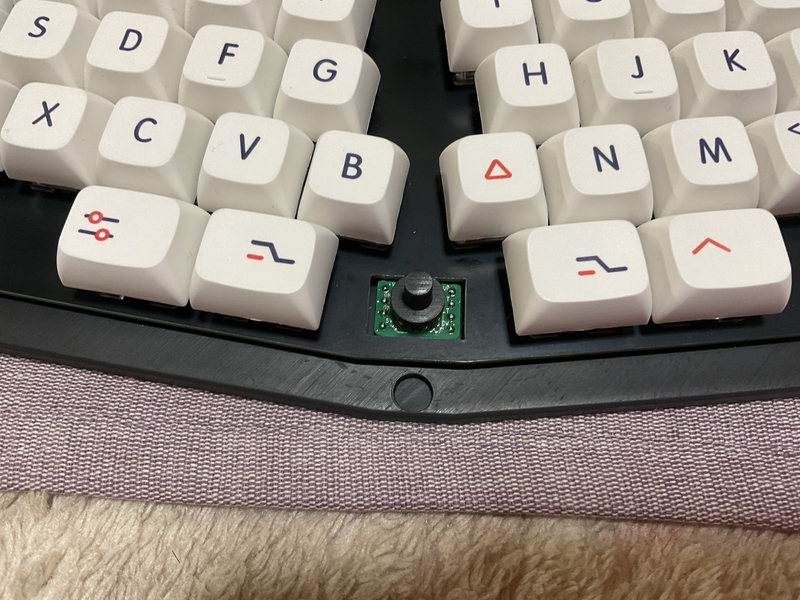

## Build guide

## Firmware

###  QMK_FIRMWARE

[Here](https://github.com/telzo2000/cool836qalble/tree/main/firmware/cool836qalble2)

 

## Build 1

### 1 Diode soldering

Solder the diodes to the back of PCB.
 
PCBの裏面にダイオードのハンダ付けをします。
 

There are lead type and SMD diodes.
 
ダイオードはリードタイプか、SMDがあります。
 
Here, we will explain the lead type soldering.
 
ここでは、リードタイプのハンダ付けの説明をします。
 

Use a lead bender to bend the legs of the diode.
 
リードベンダーを使い、ダイオードの足を曲げます。
 

Insert the diode into the board.
 
ダイオードを基板に挿しこみます。
 

Please pay attention to the orientation of the diode.
 
ダイオードの向きに注意してください。
 

Secure the diode with masking tape, then face up.
 
マスキングテープでダイオードを固定してから、表面を上にします。
 
Solder the protruding legs.
 
はみ出ている足部分に、ハンダ付けをします。
 
After soldering, use nippers to cut off the protruding legs.
 
はんだ付けが終わったら、はみ出ている足をニッパーで切り取ってください。
 

[８倍速　Diodeハンダ付け動画](https://youtu.be/Yaodh2-XxV4)

 
 

### 2 Soldering switch sockets

Solder the switch sockets on the back side.
 
裏面にスイッチソケットのハンダ付けをします。
 

[８倍速　Switch socketハンダ付け動画](https://youtu.be/E__mHvmIXQo)

  

### 3 Soldering the capacitor

Solder the [capacitor](https://akizukidenshi.com/catalog/g/gP-02151/).
 
[コンデンサー](https://akizukidenshi.com/catalog/g/gP-02151/)をハンダ付けします。
 

First, apply solder to the terminal on one side. Then, place the capacitor, melt the solder, and fix it.
 
最初に、片側の端子にハンダを盛ります。そして、コンデサーを置き、ハンダを溶かして、固定します。
 

Next, melt and pour solder into the other terminal and attach the capacitor. Please fix it.
 
次に、もう片側の端子にハンダを溶かして、流し込んで、コンデンサーを。固定してください。
 
 

### 4 Soldering the slide switch

Insert the [slide switch](https://shop.yushakobo.jp/products/5624?variant=45044666007783) from the back side of the PCB and solder the front side. Please remove the protruding legs.
 
[スライドスイッチ](https://shop.yushakobo.jp/products/5624?variant=45044666007783)はPCBの裏面から挿入して、表面をハンダ付けします。はみ出た足は、切り取ってください。
 

### 5 Mounting the Ble Micro Pro

Conthrough specifications are recommended.
 
コンスルーの仕様を推奨します。
 
 
A 13-pin connector is required.
 
コンスルーは13ピンが必要です。
 

Please take a look at the image below and pay attention to the orientation of the [Ble Micro Pro](https://shop.yushakobo.jp/products/ble-micro-pro/).
 

下の画像を見て、[Ble Micro Pro](https://shop.yushakobo.jp/products/ble-micro-pro/)の向きに気を付けて装着してください。
 

### 6 Soldering the battery board

 

Solder [the battery holder](https://www.monotaro.com/p/8835/2765/) to the PCB as shown in the image below.
 

下の画像のように、[電池ホルダー](https://www.monotaro.com/p/8835/2765/)をPCBにはんだ付けしてください。
 

z
 
 

### 7 (Option) Solering the reset switch

Actually, it's not necessary. If you are an cool836qalble2 and are trying to install a PRO micro without buying a Ble Micro Pro, you will need a reset switch.
 

実は必要ありません。もし、あなたがcool836qalble2なのに、Ble Micro Proをおごることをせずに、ただのpro micro取り付けようとするならば、リセットスイッチは必要でしょうね。

### 8 Soldering the joystick

Solder the [joystick](https://akizukidenshi.com/catalog/g/g115233/) as shown in the image below.
 

下の画像のように、[ジョイスティック](https://akizukidenshi.com/catalog/g/g115233/)をはんだ付けしてください。
 

 

### 9 Instorlling QMK＿Firmware on Ble Micro pro

The following is from cool836qalble. It is basically the same for cool836qalble2, so please refer to it.
 
以下は、cool836qalbleのものです。cool836qalble２でも、基本的に同じですので、参考にしてください。
 
 

Connect Ble Micro pro and PC with cable.
 
Ble Micro proとPCをケーブルで繋ぎます。
 
 
Access [here](https://sekigon-gonnoc.github.io/BLE-Micro-Pro-WebConfigurator/#/home).
 
[ここ](https://sekigon-gonnoc.github.io/BLE-Micro-Pro-WebConfigurator/#/home)にアクセスします。
 

Click NEXT at the bottom.
 
下段のNEXTをクリックします。
 
You will be asked for the bootloader version, but if you choose the latest version, you should be fine.
 
bootloaderのバージョンを聞かれますが、最新版で選んでおけば、大丈夫と思います。
 
 
Click Update.
 
Updateをクリックします。
 
 
It will ask for a serial port connection, so choose the one with the connected cable.
 
シリアルポートの接続を要求しますので、繋がっているケーブルのものを選んでください。
 
You will be asked the same question again, but don't worry, just repeat it again. One of these days, you can update. After that, click Next.
 
同じようなことをもう一度尋ねられますが、気にせず、もう一回繰り返してください。そのうち、Updateができます。そのあとは、Nextをクリックしてください。
 

You will be asked for the application version, but if you choose the latest version, I think it's great. Then click Update. Then, when you get a connection request, do the same as before.
 
application versionを尋ねられますが、最新版を選べば、大乗と思います。そして、Updateをクリックしてください。その後、接続要求が出たら、先ほどと同じようにしてください。
 

We recommend setting Debounce to 3. Chattering occurred in the author's environment. After 3 it's stable.
 
Debounceを３にしておくことを勧めます。作者の環境では、チャタリングが発生しました。３にしてからは安定しています。
 

Click Update and you will be prompted to connect, just do the same as before.
 
Updateをクリックすると、接続要求が出ますので、前と同じようにしてください。
 

congratulations. The first stage is finished.
 
おめでとうございます。第一段階が終了しました。
  
Click on QMK Confiurator for Ble Micro Pro.
 
次にQMK Confiurator for Ble Micro Proの方をクリックしてください。
 

You will be asked to connect, so do the same as before.
 
接続要求がきますので、前と同じようにしてください。
 

config.json is requested. Download the config.json [here](https://github.com/telzo2000/cool836qalble2/tree/main/firmware/cool836qalble2) and use it.
 
config.jsonが要求されます。[ここ](https://github.com/telzo2000/cool836qalble2/tree/main/firmware/cool836qalble2)にあるconfig.jsonをダウンロードして、使用してください。
 
 
Congratulations. The second stage is over.
 
おめでとうざいます。第二段階が終わりました。
 

Select [Remap](https://qmk018.remap-keys.app/configure) from here.
 

ここから[Remap](https://qmk018.remap-keys.app/configure)を選択してください。
 

json file is requested, so select via.json located [here](https://github.com/telzo2000/cool836qalble2/tree/main/firmware/cool836qalble2).
 

jsonファイルが要求されますので、[ここ](https://github.com/telzo2000/cool836qalble2/tree/main/firmware/cool836qalble2)にある、via.jsonを選択してください。

 
Edit your favorite keymap.
 
自分好みのキーマップを編集してください。
 

 

 
congratulations. The third stage is finished. Firmware is complete.
 
おめでとうございます。第三段階が終了しました。ファームウェアが完成です。

### Build 2(case)

### 1 Case

I will explain using a case printed by stereolithography of black resin ordered from JLCPCB. The procedure is basically the same for cases printed with Ankemake M5 for home use.
 
JLCPCBに発注したブラックレジンの光造形で印刷されたケースを使って説明します。家庭用AnkemakeM5で印刷したケースでも作業の手順は、基本的に同じです。
 
 
Fix the magnets to the five dents inside the case with an adhesive or the like. There are 5 in the top case and 5 in the bottom case for a total of 10.Please pay attention to the polarity of the magnet. Make sure the top case and bottom case are magnetically attached.
 
ケースの内側にある５つの凹みに磁石を接着剤などで固定します。トップケースに５箇所、ボトムケースに５箇所の合計10箇所です。
極性に注意してください。トップケースとボトムケースが磁力で着くようにしてください。
 

As shown in the image below, attach rubber O-rings to the four protrusions on the bottom case. This makes it a gasket mount. You can do without the O-ring, but the PCB may move up and down inside the case.
 
下の画像のように、ボトムケースに4箇所の凸部にゴムのO-ringを装着します。これによりガスケットマウントとなります。O-ringはなくても大丈夫ですが、ケース内で、PCBが上下に動く可能性があります。
 

The O-ring in the image is [this product](https://www.amazon.co.jp/gp/product/B07G4SM5SM/ref=ppx_yo_dt_b_asin_title_o03_s00?ie=UTF8&psc=1).
 
画像のO-ringは[この商品](https://www.amazon.co.jp/gp/product/B07G4SM5SM/ref=ppx_yo_dt_b_asin_title_o03_s00?ie=UTF8&psc=1)です。
 
Pay attention to the orientation of the Switch Parts and attach them to the bottom case.
 
Switch Partsの向きに注意して、ボトムケースに取り付けてください。
 

 
Place the hole in the switch plate on the O-ring. 
 
スイッチプレートの穴をO-ringに載せます。このとき、水平スライドスイッチのつまみがSwitch Pasrtsの窪みに入るようにしてください。
 
 
Place the knob on the joystick.
 
ジョイスティックにノブを載せてください。

 
Please cover with the top case.
 
トップケースを被せてください。

Welcome to the world of 36 keys.
 
36キーの世界へようこそ。
 
